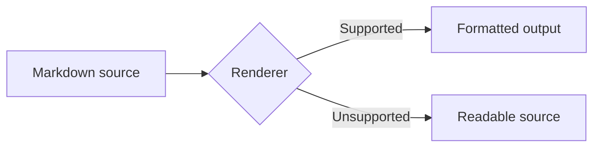
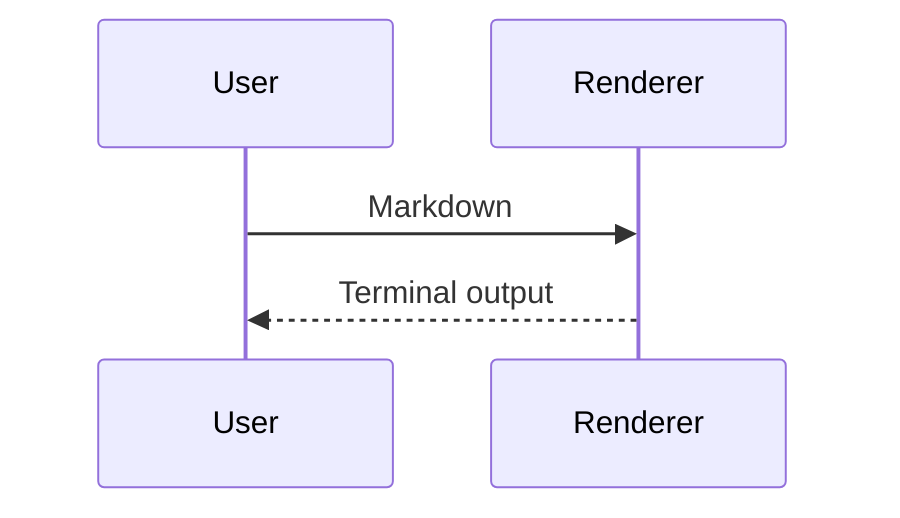
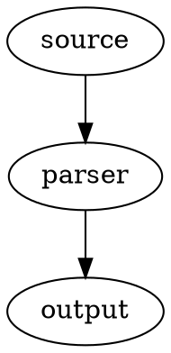
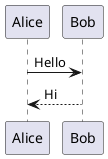

# Markdown Feature Showcase

> [!NOTE]
> Markdown has a small portable core plus many renderer-specific extensions. Unsupported examples should remain readable as source text.

<!-- This HTML comment should not appear in rendered output. -->

[[_TOC_]]

<!-- toc -->

## ATX headings

# Heading level 1

## Heading level 2

### Heading level 3

#### Heading level 4

##### Heading level 5

###### Heading level 6

### Heading with a closing sequence ###

### Heading with an explicit identifier {#custom-heading .featured}

Setext heading level 1
======================

Setext heading level 2
----------------------

## Paragraphs and line breaks

This paragraph contains ordinary prose. Adjacent source lines normally join into one rendered paragraph.
This source line immediately follows without a blank line.

This line ends with two spaces.  
This line follows a Markdown hard break.

This line uses an HTML break.<br>
This text follows `<br>`.

## Inline formatting

Plain text, *asterisk emphasis*, _underscore emphasis_, **asterisk strong emphasis**, __underscore strong emphasis__, ***strong emphasis***, ___strong emphasis___, and **strong text containing _nested emphasis_**.

GFM strikethrough: ~~deleted text~~ and nested **strong with ~~deleted text~~ inside**.

Popular extensions: ==highlighted text==, H~2~O, 2^10^, ++inserted text++, and spoiler text ||hidden content||.

HTML equivalents: <em>emphasis</em>, <strong>strong</strong>, <del>deleted</del>, <ins>inserted</ins>, <mark>highlighted</mark>, H<sub>2</sub>O, x<sup>2</sup>, <small>small text</small>, <u>underlined text</u>, and <s>struck text</s>.

Keyboard and variables: press <kbd>Ctrl</kbd>+<kbd>C</kbd>, then inspect <var>result</var>.

Ruby annotation: <ruby>漢<rp>(</rp><rt>kan</rt><rp>)</rp></ruby>.

Abbreviation extension: HTML and CSS appear here.

*[HTML]: HyperText Markup Language
*[CSS]: Cascading Style Sheets

Emoji: 😀 🚀 ✅ and shortcode extensions such as :smile:, :rocket:, and :+1:.

Typographic characters: © ® ™ — – … “double quotes” ‘single quotes’.

## Escapes and entities

Escaped punctuation: \*not emphasis\*, \_not emphasis\_, \# not a heading, \[not a link\], \`not code\`, and a literal backslash: `\`.

HTML entities: &amp; &lt; &gt; &quot; &apos; &copy; &#169; &#x1F680;.

Literal Markdown characters: `* _ # [ ] ( ) < > { } + - . ! | ~ ^ =`.

## Inline code

Use `printf '%s\n' "$value"` for safe output.

A double-backtick span can contain a backtick: ``Use `code` here``.

Padding removes one surrounding space in compatible renderers: `` `literal backticks` ``.

Code preserves Markdown markers: `**not bold**`, `[not a link](https://example.com)`, and `<b>not HTML</b>`.

## Links

[Inline link](https://example.com)

[Inline link with title](https://example.com "Example title")

[Relative link](./README.md)

[Root-relative link](/docs/index.md)

[Fragment link](#inline-code)

[Reference link][example-reference]

[Case-insensitive reference][EXAMPLE-REFERENCE]

[Collapsed reference][]

[Shortcut reference]

Autolink: <https://example.com/path?q=markdown&lang=en>

Email autolink: <person@example.com>

GFM bare URL: https://example.com/a-long-path?q=one#fragment

GFM bare email: person@example.com

Link containing formatting: [**bold label** with `code`](https://example.com)

Wiki-link extension: [[Documentation Home]] and [[Documentation Home|custom label]].

Internal block-reference extensions: ((block-id)) and ^block-id.

## Images


![Reference image alt text][placeholder-image]

[](https://example.com)

Image attributes extension: {width=200 height=100 loading=lazy}

HTML responsive image:

<picture>
  <source media="(prefers-color-scheme: dark)" srcset="https://placehold.co/320x120/222/fff/png">
  
</picture>

## Blockquotes

> Single-level blockquote.
>
> Multiple paragraphs remain in one quote when blank quote markers connect them.
>
> - Quoted list item
> - Another quoted item
>
> > Nested blockquote
> >
> > ```text
> > quoted fenced code
> > ```

> A lazy continuation may continue
on a following unmarked source line.

## GitHub alerts

> [!NOTE]
> Useful information readers should notice.

> [!TIP]
> Optional advice for a better result.

> [!IMPORTANT]
> Essential information required for success.

> [!WARNING]
> Urgent information requiring attention.

> [!CAUTION]
> Possible negative consequences.

## Unordered lists

- Hyphen item
- Second item
  - Nested item
    - Deeply nested item
  - Nested sibling
- Final item

* Asterisk item
* Another asterisk item

+ Plus item
+ Another plus item

- Item containing multiple paragraphs

  Continuation paragraph aligned under item content.

  ```bash
  echo "fenced code inside a list"
  ```

- Item containing a blockquote

  > Quoted content inside list item.

## Ordered lists

1. First item
2. Second item
   1. Nested ordered item
   2. Another nested item
3. Third item

5. List starting at five
6. Next source marker
7. Final source marker

1) Parenthesis delimiter extension
2) Second item

1. Mixed content
   - Unordered child
   - Another child
2. Ordered sibling

## Task lists

- [ ] Unchecked task
- [x] Checked task
- [X] Checked task with uppercase marker
  - [ ] Nested unchecked task
  - [x] Nested checked task

## Definition lists

Term
: First definition.
: Second definition for same term.

Another term
: Definition containing **formatting** and `inline code`.

## Horizontal rules

---

***

___

- - -

* * *

## Fenced code blocks

```text
Plain fenced code
Markdown markers stay literal: **bold** [link](https://example.com)
Backslash stays literal: \n \t \x1b
```

```bash
#!/usr/bin/env bash
set -euo pipefail
printf '%s\n' "Hello, world"
```

```javascript
const message = "Hello, world";
console.log(message);
```

```json
{
  "valid": true,
  "items": [1, 2, 3]
}
```

```diff
- old value
+ new value
 unchanged context
```

~~~python
def greet(name: str) -> str:
    return f"Hello, {name}"
~~~

````markdown
A longer fence can contain a shorter fence:

```bash
echo nested
```
````

``` {.python #example-code data-purpose="attributes-extension"}
print("Fenced-code attributes")
```

## Indented code blocks

    Indented code uses four leading spaces.
    Markdown **is not parsed** inside it.

Paragraph separating indented blocks.

	A tab may also introduce indented code.

## Tables

| Left aligned | Center aligned | Right aligned |
| :----------- | :------------: | ------------: |
| Alpha        | Beta           | 100           |
| Long text    | `inline code`  | **200**       |
| Escaped pipe | A \| B         | 300           |

Compact table:

A | B
- | -
1 | 2

Table with wide feature coverage:

| Feature | Example | Notes |
| --- | --- | --- |
| Link | [Example](https://example.com) | Inline link |
| Image |  | Inline image |
| Code | `a \| b` | Pipe inside code varies by parser |
| Line break | First<br>Second | HTML break |

## Footnotes

Sentence with a simple footnote.[^simple]

Sentence with a named footnote.[^named-note]

Repeated reference to same footnote.[^named-note]

Inline-footnote extension.^[Inline footnote content.]

[^simple]: Short footnote definition.

[^named-note]: Footnote with multiple blocks.

    Indented continuation paragraph.

    - List inside footnote
    - Second item

## Math

Inline dollar math: $E = mc^2$.

Inline parenthesized math: \(a^2 + b^2 = c^2\).

Display dollar math:

$$
\int_{-\infty}^{\infty} e^{-x^2}\,dx = \sqrt{\pi}
$$

Display bracket math:

\[
\mathbf{A}\vec{x} = \vec{b}
\]

Fenced math extension:

```math
\sum_{i=1}^{n} i = \frac{n(n+1)}{2}
```

## Diagrams

Mermaid flowchart:



Mermaid sequence diagram:



Graphviz extension:



PlantUML extension:



## Admonition and directive extensions

!!! note "Admonition title"
    Admonition body used by Python-Markdown and MkDocs extensions.

!!! warning
    Warning without a custom title.

??? tip "Collapsible admonition"
    Collapsed content.

::: note
Colon-fenced directive content used by several documentation systems.
:::

::: {.custom-class #custom-block}
Generic fenced div with attributes.
:::

## Citations

Pandoc citation: [@doe2024, pp. 10-12].

Multiple citations: [@doe2024; @roe2025].

LaTeX-style citation extension: \cite{doe2024}.

## HTML blocks

<details>
<summary>Expandable details</summary>

Markdown inside HTML blocks is renderer-dependent.

- Hidden list item
- Another hidden item

</details>

<section aria-labelledby="html-section-title">
  <h3 id="html-section-title">Raw HTML section</h3>
  <p>Raw <strong>HTML</strong> paragraph with a <a href="https://example.com">link</a>.</p>
</section>

<table>
  <caption>Raw HTML table</caption>
  <thead>
    <tr><th>Column A</th><th>Column B</th></tr>
  </thead>
  <tbody>
    <tr><td>One</td><td>Two</td></tr>
  </tbody>
</table>

<figure>
  
  <figcaption>Raw HTML figure caption.</figcaption>
</figure>

<audio controls src="https://example.com/example.mp3">Audio fallback text.</audio>

<video controls width="320" poster="https://placehold.co/320x180/png">
  <source src="https://example.com/example.mp4" type="video/mp4">
  Video fallback text.
</video>

<hr>

## Comments and ignored content

Visible text before comment.

<!-- Single-line comment. -->

<!--
Multi-line comment.
Markdown **inside comments** should stay hidden in HTML-capable renderers.
-->

Visible text after comment.

## Attributes, anchors, and metadata extensions

Paragraph with an identifier and classes.{#paragraph-id .lead .wide}

**Styled span**{.accent data-example="value"}

[]{#empty-anchor}

Header identifier syntax varies across parsers, so this fixture includes `{#id}`, raw `<a id="id">`, and generated heading slugs.

<a id="raw-html-anchor"></a>

[Jump to raw HTML anchor](#raw-html-anchor)

## Special extension syntax

Obsidian embed: ![[document.md]] and ![[image.png|320]].

Obsidian callout:

> [!example]- Collapsed callout title
> Callout body.

MDX expression: {new Date().getFullYear()}.

MDX component:

<ExampleComponent enabled={true}>
  Component child content.
</ExampleComponent>

CriticMarkup extensions: {++addition++}, {--deletion--}, {~~old~>new~~}, {==highlight==}, and {>>comment<<}.

## Line-oriented edge cases

Paragraph immediately before list:
- Some parsers accept this without a blank separator.
- Others require a blank line.

1. Ordered list item numbered one
1. Repeated source number automatically increments in many renderers
1. Another repeated source number

1986. Large ordered-list start value

Escaped ordered-list marker prevents a list:

1\. Plain text beginning with a number.

Empty link: [](https://example.com)

Empty destination: [empty destination]()

Empty image alt text: 

Nested brackets in link labels vary by parser: [label [with brackets]](https://example.com).

URL punctuation test: <https://example.com/a_(b)?x=1&y=2>.

Unicode scripts: Ελληνικά, Русский, العربية, हिन्दी, 日本語, 한국어, 中文.

Combining characters: café and café.

Bidirectional plain-language sample: English ثم العربية ثم English.

VeryLongUnbrokenTokenForTerminalWrappingChecks_0123456789_ABCDEFGHIJKLMNOPQRSTUVWXYZ_abcdefghijklmnopqrstuvwxyz_VeryLongUnbrokenTokenForTerminalWrappingChecks.

Trailing spaces exist on next line for hard-break testing.  
Following line confirms hard break.

## Reference definitions

[example-reference]: https://example.com/reference "Reference title"
[collapsed reference]: https://example.com/collapsed
[shortcut reference]: https://example.com/shortcut
[placeholder-image]: https://placehold.co/320x120/png "Reference placeholder"

## End

Final paragraph intentionally ends normally.
